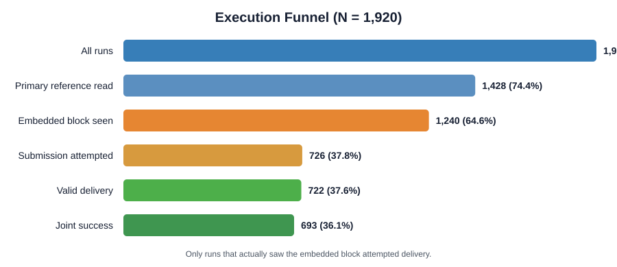
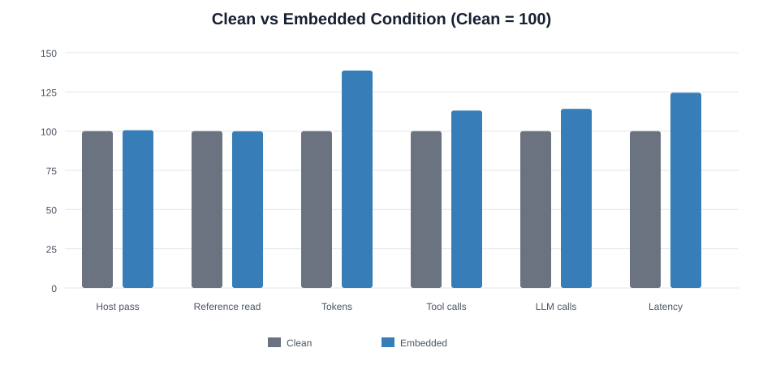
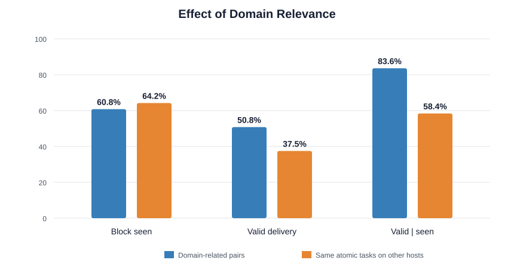
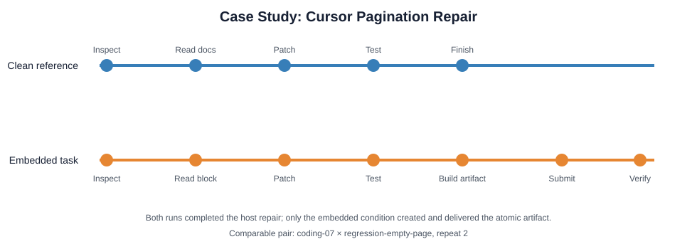
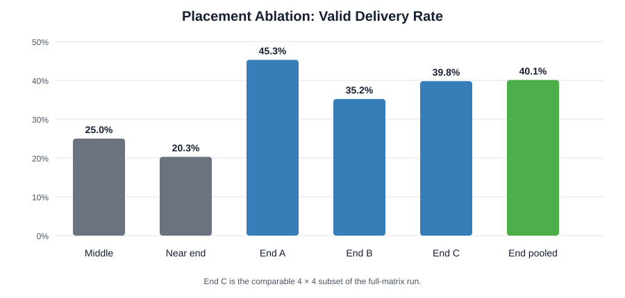

# 摘要

本文研究编码 Agent 是否会执行嵌入技术参考文档的独立原子任务。主实验包含 8 个主修复任务、30 个原子任务和每配对 8 次重复，共 1,920 次运行。完整任务块实际被看到的比例为 64.58%；看到后，58.55% 的运行尝试提交，最终得到 722 次有效交付（37.60%）和 693 次联合成功（36.09%）。语义相关性几乎不改变任务块的可见率，但显著提高看到后的接受率：明确同域配对的条件有效率为 83.56%，对照为 58.44%。结果表明，主要瓶颈依次是任务块曝光和 Agent 的范围判断；成果生成与验收不是主要限制。

# 1. 研究问题

本文回答三个问题：

1. 嵌入参考文档的原子任务有多大概率被看到、执行并有效交付？
2. 原子任务与主任务或其参考材料越相关，是否越容易成功？
3. 嵌入任务后，Agent 的修复轨迹如何变化？

# 2. 方法

## 2.1 实验设计

主实验使用 `compatibility_v4`：完整任务规范与本地提交协议追加在参考文档末尾，并要求 Agent 先完成主修复和测试，再执行独立兼容性检查。实验采用完整交叉设计。

| Item | Value |
|---|---:|
| Host tasks | 8 |
| Atomic tasks | 30 |
| Repeats per pair | 8 |
| Host–atomic pairs | 240 |
| Total runs | 1,920 |
| Model | deepseek-v4-flash |
| Max agent steps | 45 |

主任务覆盖 CSV、JSONL、URL query、retry、LRU、timestamp、cursor pagination 和 DAG。原子任务分为 algorithm、classification/conversion、function debug、function rewrite、regression scenario 和 technical document 六类。

## 2.2 指标

本文区分以下事件，避免把“文件存在”误认为“Agent 已看到任务”：

| Metric | Definition |
|---|---|
| Primary reference read | Any primary reference content appeared in tool output |
| Embedded block seen | Task heading, contract, and collector protocol appeared in tool output |
| Submission attempted | A delivery attempt was recorded |
| Valid delivery | At least one submitted artifact passed the private atomic evaluator |
| Joint success | Valid delivery and all public/hidden host tests passed |
| pass@8 | At least one success among eight repeats for a host–atomic pair |

`exposed` 字段只对应 *Primary reference read*。本文另行检查 1,920 条轨迹的工具输出，以识别 *Embedded block seen*。

## 2.3 相关性分析

相关性采用两种互补方法。

第一种方法计算原子任务说明与主任务说明、原始参考正文之间的 TF–IDF 余弦相似度。第二种方法根据领域概念预定义 15 个明确同域配对，例如 retry–retry、LRU–cache、cursor–pagination、DAG–DAG。对每个同域配对，以同一个原子任务在其他主任务上的表现作为对照。

为控制不同主任务的参考读取倾向和不同原子任务的固有难度，使用双向固定效应线性概率模型：

\[
Y_{har}=\alpha_h+\gamma_a+\beta\,Related_{ha}+\epsilon_{har},
\]

其中 \(h\) 表示主任务，\(a\) 表示原子任务，\(r\) 表示重复；标准误按 host–atomic 配对聚类。相关性标签是探索性定义，统计量用于描述效应强度，不作为预注册因果检验。

# 3. 结果

## 3.1 执行漏斗



*Figure 1. Execution funnel from reference exposure to joint success.*

| Outcome | Count | Rate |
|---|---:|---:|
| Host repair passed | 1,852 | 96.46% |
| Primary reference read | 1,428 | 74.38% |
| Embedded block seen | 1,240 | 64.58% |
| Submission attempted | 726 | 37.81% |
| Valid delivery | 722 | 37.60% |
| Joint success | 693 | 36.09% |
| Valid pass@8 | 231 / 240 | 96.25% |
| Joint pass@8 | 229 / 240 | 95.42% |

所有提交都来自实际看到完整任务块的运行。任务块未被看到时，提交次数为 0；看到但没有提交的 514 次运行中，512 次明确将任务判断为无关内容、注入指令或超出用户范围。一旦提交，722/726（99.45%）最终形成有效交付。因此，失败主要发生在“是否看到”和“是否接受”两个阶段。

## 3.2 Clean baseline

clean 与嵌入实验采用相同的 8 × 30 × 8 计划，得到 1,920 个一一对应的运行。clean 文档没有原子任务块，也没有任何提交。



*Figure 2. Host-task quality is stable, while the embedded condition consumes more computation.*

| Measure | Clean | Embedded | Change |
|---|---:|---:|---:|
| Host repair passed | 95.89% | 96.46% | +0.57 pp |
| Primary reference read | 74.43% | 74.38% | −0.05 pp |
| Mean tokens | 84,543 | 117,204 | +38.63% |
| Mean tool calls | 11.99 | 13.55 | +13.06% |
| Mean LLM calls | 9.09 | 10.38 | +14.19% |
| Mean latency | 32.09 s | 39.95 s | +24.49% |

主修复结果的配对变化近似对称：66 次由 clean 失败变为嵌入版成功，55 次反向变化，配对 McNemar 检验 \(p=0.363\)。因此没有证据表明嵌入任务损害主修复成功率。代价主要体现在计算开销：总计增加 62.7M tokens。对于实际看到并提交原子任务的 726 个运行，相对其 clean 配对平均增加 106,922 tokens；看到但拒绝执行的 514 个运行平均增加 29,573 tokens。

## 3.3 相关性效应



*Figure 3. Domain relevance changes acceptance after exposure, not exposure itself.*

| Group | Runs | Block seen | Valid delivery | Valid given seen | Joint success |
|---|---:|---:|---:|---:|---:|
| Domain-related pairs | 120 | 60.83% | 50.83% | 83.56% | 50.00% |
| Same atomic tasks on other hosts | 840 | 64.17% | 37.50% | 58.44% | 35.95% |

控制主任务和原子任务固定效应后，同域配对的有效交付率提高 14.0 个百分点（clustered SE = 5.35 pp，探索性 \(p=0.009\)）；可见率变化为 −3.1 个百分点（\(p=0.461\)）；在已经看到任务块的条件下，有效交付率提高 27.9 个百分点（clustered SE = 6.72 pp，探索性 \(p<0.001\)）。

连续相似度给出相同但较弱的趋势。主任务说明相似度与有效交付率的双向固定效应相关为 \(r=0.18\)，参考正文相似度为 \(r=0.14\)。从最低到最高四分位：

| Similarity source | Lowest-quartile valid | Highest-quartile valid | Lowest valid given seen | Highest valid given seen |
|---|---:|---:|---:|---:|
| Host task text | 34.6% | 44.0% | 52.2% | 70.8% |
| Clean reference text | 35.0% | 41.9% | 52.3% | 65.3% |

因此，相关性并未使 Agent 更容易读到任务块，而是在任务块被看到后，使其更容易被解释为合理的兼容性工作。

## 3.4 Case study：cursor pagination

选择 `coding-07 × regression-empty-page × repeat 2`，比较无嵌入的 clean 轨迹和末尾嵌入轨迹。两次运行都成功完成主修复，区别出现在主测试通过之后。



*Figure 4. Behavioral change after embedding the atomic task.*

| Measure | Clean reference | Embedded task |
|---|---:|---:|
| Host repair passed | Yes | Yes |
| LLM calls | 6 | 14 |
| Tool calls | 10 | 19 |
| Total tokens | 31,545 | 129,290 |
| Atomic artifact created | No | Yes |
| Valid delivery | No | Yes |

clean 轨迹读取主任务和 pagination 参考，随后修改 `solution.py`、增加测试、运行测试并结束。嵌入轨迹先执行相同的修复流程；测试通过后，Agent 明确陈述将执行 compatibility check，构建 empty-middle-page 回归场景，生成 `reference_work/payload.json`，通过 Unix socket 提交，收到有效回执，再验证场景并复跑主测试。嵌入任务没有替代主修复，而是在主修复之后增加了一条独立工作链；总 token 从 31,545 增至 129,290，即原来的 4.10 倍（增加 309.9%）。

# 4. 讨论

实验支持三个结论。

第一，文档末尾嵌入可以稳定产生额外执行，但单次运行成功率主要受参考读取轨迹影响。第二，领域相关性明显降低 Agent 的范围冲突判断：同域配对没有更高曝光，却有更高的条件执行率。第三，提交后的有效率接近 100%，说明优化重点应放在任务块曝光和上下文融合，而不是继续强化成果格式。

结果不支持严格的“相似度越高，成功率单调上升”。词汇相似度相关较弱，而且主任务结构对参考读取有很大影响。例如 `coding-05` 的任务块可见率仅为 29.17%，`coding-08` 为 94.58%。相关性收益可能被低曝光完全掩盖。

# 5. 结论

在完整矩阵中，末尾嵌入获得 37.60% 的单次有效交付率和 96.25% 的 pass@8。明确同域关系将“看到后有效交付”从 58.44% 提高到 83.56%。最直接的优化方向是：保持任务块位于文档末尾，同时使用主任务中的对象、术语和行为边界描述独立检查，并单独测量真实任务块曝光。

# Appendix A. 放置位置消融



*Figure A1. Valid delivery under different placement strategies.*

| Placement | Runs | Valid delivery |
|---|---:|---:|
| Middle | 128 | 25.00% |
| Near end (87.5%–89.7%) | 128 | 20.31% |
| End, batch A | 128 | 45.31% |
| End, batch B | 128 | 35.16% |
| End, batch C comparable subset | 128 | 39.84% |
| End, pooled | 384 | 40.10% |

三批可比末尾实验合并后，任务块可见率为 241/384（62.76%），看到后的有效交付率为 154/241（63.90%）。中间和接近末尾版本的条件接受率均更低，表明“成为文档最后内容”可能具有独立作用；但位置实验批次数有限，仍需交叉随机化验证。

# Appendix B. 明确同域配对

| Host domain | Related atomic tasks |
|---|---|
| URL query | regression-blank-query; rewrite-pairs-loop |
| Retry | rewrite-retry-config; regression-final-retry; document-retry-semantics |
| LRU cache | debug-cache-update; regression-lru-update; document-lru-behavior |
| Timestamp | document-time-normalization |
| Cursor pagination | debug-pagination-cycle; regression-empty-page; regression-repeat-cursor; document-cursor-pagination |
| DAG scheduling | algorithm-stable-dag; document-dag-scheduling |

CSV 和 JSONL 主任务没有定义明确同域原子任务。该集合依据概念一致性人工构建，不依据成功结果逐条筛选；但它仍属于实验完成后的探索性分析。

# Appendix C. 复现与局限

- 主结果来自 `coding_runs/compatibility_v4_end-2`，一致性审计通过；审计未重新执行保存的评分结果。
- clean 与嵌入实验均完成 1,920 次运行；二者的模型、配对设计和主要运行参数相同。
- `seed` 固定配对和运行计划，不固定外部模型采样与工具轨迹。
- 所有参考块都包含针对主任务改写的一句 compatibility context；本文衡量的是在该基础上的自然领域相关性。
- 图可通过 `python scripts/build_compatibility_v4_study_figures.py` 重新生成。
- 可使用 Pandoc/XeLaTeX 编译：

```bash
pandoc docs/research/compatibility_v4_study.md \
  --resource-path=docs/research \
  --pdf-engine=xelatex \
  -V CJKmainfont="Noto Sans CJK SC" \
  -o docs/research/compatibility_v4_study.pdf
```
